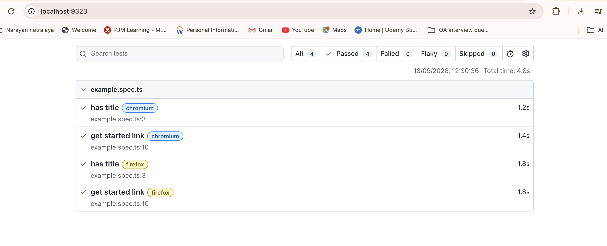

Playwright Assignment

- This project contains simple UI automated tests written using Playwright, TypeScript, and the @playwright/test test runner.

Prerequisites:

- Make sure you have the following installed:
1. Node.js v20.12.0
2. npm 10.5.0

Installation:

1. Install the project dependencies:
npm install
2. Install the Playwright browsers:
npx playwright install

Running the Tests:

1. Run all tests:
npx playwright test
2. Run the TodoMVC test in headed mode:
npx playwright test tests/todo_playwright.spec.ts --headed
3. Run tests only in Chromium:
npx playwright test --project=chromium
4. Run tests only in Firefox:
npx playwright test --project=firefox
5. Run a specific test file:
npx playwright test tests/todo_recorded.spec.ts

Test Browsers:

The project is configured to run tests against:
1. Chromium
2. Firefox

Test Files:
tests/example.spec.ts

- Contains the default Playwright example tests:
1. Verifies the page title.
2. Verifies the "Get started" link.
tests/todo.spec.ts

Contains the main TodoMVC test flow:

1. Opens the TodoMVC application.
2. Adds "Learn Playwright".
3. Adds "Write tests".
4. Completes "Learn Playwright".
5. Filters completed todos.
6. Filters active todos.
7. Verifies "Write tests" remains active.
8. Clears completed todos.
9. Verifies the expected todo remains.
tests/todo_record.spec.ts

Contains an additional TodoMVC test created using Playwright's recording/code generation workflow.

AI Usage:
Assistant Used
- ChatGPT was used as an AI coding assistant.

What It Was Used For:
-ChatGPT was used to:
1. Troubleshoot the Playwright WebKit browser error.
2. Redundant clicks and assertions were removed.
3. Test names and comments were improved to describe the intended behavior.
4. Help structure and document this README

Test Report:
- Playwright uses the HTML reporter.
- After running the tests, open the report with:
npx playwright show-report

Project Structure:
playwright-assignment/
├── tests/
│   ├── example.spec.ts
│   ├── todo_playwright.spec.ts
│   └── todo_recorded.spec.ts
├── playwright.config.ts
├── package.json
├── package-lock.json
└── README.md

Successful Test Run:
The final test suite is configured to run against Chromium and Firefox.
Expected result:
8 passed
This represents 4 tests running against 2 configured browsers.

Screenshots:
-The following screenshot shows the successful `npx playwright test` execution:

